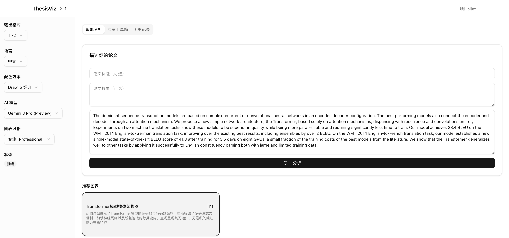
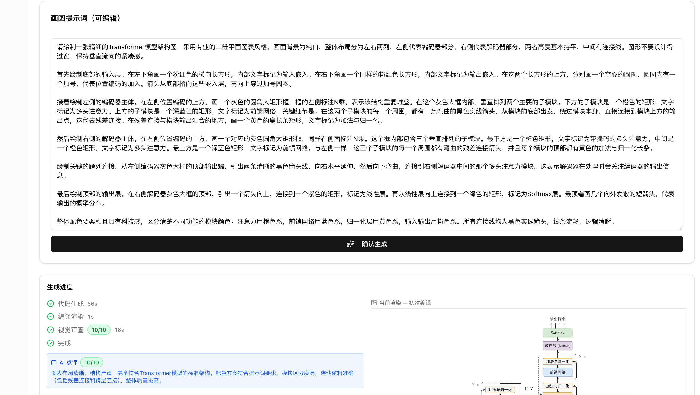
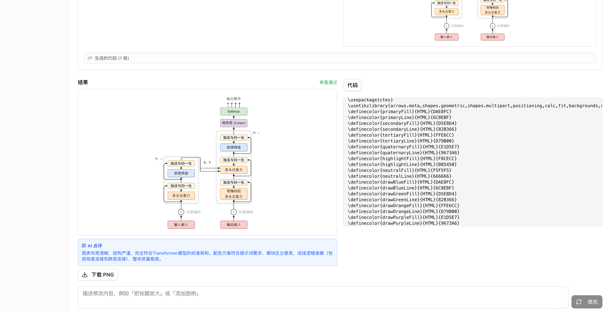
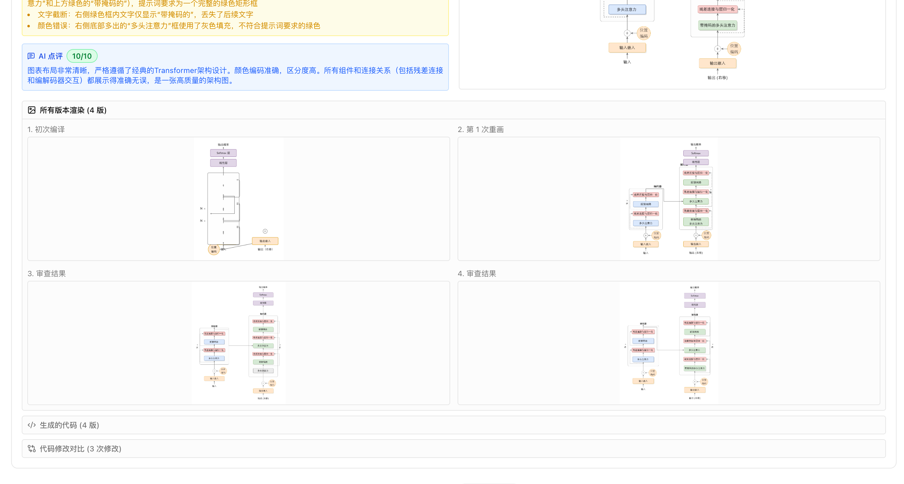

<div align="center">

#  ThesisViz

**AI 驱动的学术图表生成平台**

用自然语言描述，自动生成论文级矢量图

[](https://go.dev)
[](https://nextjs.org)
[](https://react.dev)
[](https://python.org)
[](https://ai.google.dev)
[](LICENSE)

[English](./README_EN.md) | 中文

</div>

<div align="center">

<table>
<tr>
<td align="center"><b>📝 输入论文段落，AI 分析推荐图表方案</b><br><br></td>
<td align="center"><b>⚙️ 自动生成画图指令，实时流水线进度</b><br><br></td>
</tr>
<tr>
<td align="center"><b>🖼️ 高质量图表 + 源代码</b><br><br></td>
<td align="center"><b>🔄 自动重画 + AI 视觉审查迭代</b><br><br></td>
</tr>
<tr>
<td align="center" colspan="2"><b>✏️ TikZ 微调编辑器 — 可视化选中元素，精确调整属性</b><br><br></td>
</tr>
</table>

</div>

---

## 目录

- [ ThesisViz](#-thesisviz)
  - [目录](#目录)
  - [✨ 特性亮点](#-特性亮点)
    - [🎯 自然语言 → 图表](#-自然语言--图表)
    - [🖼️ 多格式输出](#️-多格式输出)
    - [🔄 多轮对话修改](#-多轮对话修改)
    - [👁️ AI 视觉审查](#️-ai-视觉审查)
    - [🎨 智能配色](#-智能配色)
    - [📤 一键导出](#-一键导出)
    - [✏️ TikZ 微调编辑器](#️-tikz-微调编辑器)
  - [🏗️ 架构概览](#️-架构概览)
  - [🚀 快速开始](#-快速开始)
    - [前置要求](#前置要求)
    - [一步一步来](#一步一步来)
  - [📖 使用流程](#-使用流程)
  - [🔑 配置 API Key](#-配置-api-key)
  - [📋 环境变量](#-环境变量)
  - [📁 项目结构](#-项目结构)
  - [🐳 Docker 部署](#-docker-部署)
  - [❓ 常见问题](#-常见问题)
  - [🛠️ 技术栈](#️-技术栈)
  - [🙏 致谢](#-致谢)
  - [📄 License](#-license)

## ✨ 特性亮点

<table>
<tr>
<td width="50%">

### 🎯 自然语言 → 图表
输入论文段落或描述，AI 自动分析并推荐合适的图表类型，全程无需手写代码

### 🖼️ 多格式输出
- **TikZ** — 出版级矢量图，直接嵌入 LaTeX 论文
- **Matplotlib** — 数据可视化图表
- **Mermaid** — 流程图、序列图、泳道图

### 🔄 多轮对话修改
在已有图表基础上用自然语言描述修改需求，AI 在现有代码上迭代

</td>
<td width="50%">

### 👁️ AI 视觉审查
Gemini Vision 自动检查生成图表的质量，发现问题自动修复，无需人工介入

### 🎨 智能配色
内置多套学术配色方案，支持从图片提取自定义配色，一键应用

### 📤 一键导出
导出完整 `.tex` 文件直接在 Overleaf 使用，或下载 PNG 图片

### ✏️ TikZ 微调编辑器
可视化选中元素高亮定位，辅助手动微调代码

</td>
</tr>
</table>

## 🏗️ 架构概览

| 组件 | 职责 |
|---|---|
| **Next.js Frontend** | 用户界面、实时进度展示、代码编辑器、图表预览 |
| **Go API Backend** | AI Agent 编排、WebSocket 推送、渲染调度、数据持久化 |
| **py-render Sidecar** | Matplotlib 沙箱执行（进程隔离 + 受限 builtins） |
| **PostgreSQL** | 项目和生成记录存储 |
| **Redis** | 缓存（可选） |
| **MinIO** | 生成图片的 S3 兼容对象存储 |

## 🚀 快速开始

### 前置要求

| 依赖 | 版本 | 安装方式 |
|---|---|---|
| Docker & Compose | - | [下载](https://docs.docker.com/get-docker/) |
| Go | 1.23+ | [下载](https://go.dev/dl/) |
| Node.js | 20+ | [下载](https://nodejs.org/) |
| Python | 3.11+ | [下载](https://www.python.org/downloads/) |
| TeX 发行版 | - | macOS: `brew install --cask mactex`<br>Ubuntu: `sudo apt install texlive-full`<br>Windows: [MiKTeX](https://miktex.org/download) |
| Gemini API Key | - | [免费获取 →](https://aistudio.google.com/apikey) |

### 一步一步来

**① 克隆项目**

```bash
git clone https://github.com/your-username/ThesisViz.git
cd ThesisViz
```

**② 配置环境变量**

```bash
cp .env.example .env
# 编辑 .env，填入你的 Gemini API Key（也可以启动后在网页上配置）
```

**③ 启动基础设施**（PostgreSQL + Redis + MinIO）

```bash
make infra
```

**④ 安装 Python 依赖**（首次运行）

```bash
make render-setup
```

**⑤ 一键启动所有服务**

```bash
make dev
```

**⑥ 打开浏览器** → [http://localhost:3000](http://localhost:3000) 🎉

> 💡 也可以在三个终端中分别启动 `make api`、`make render`、`make web`

## 📖 使用流程

```
  📝 输入论文段落
       │
       ▼
  🤖 AI 分析 → 推荐 3 种图表方案
       │
       ▼
  🎯 选择方案 → AI 生成画图指令
       │
       ▼
  ⚙️ 自动流水线：生成代码 → 编译渲染 → 视觉审查 → 自动修复
       │
       ▼
  🖼️ 得到图表 → 对话式修改 → 满意后导出
       │
       ▼
  📤 下载 PNG / 导出 .tex 到 Overleaf
```

1. **创建项目** — 为你的论文创建项目，填写标题和摘要以提供上下文
2. **输入文本** — 粘贴需要配图的论文段落
3. **AI 分析** — 系统分析文本，推荐 3 种图表方案（标题 + 描述）
4. **选择方案** — 选定一个方案，AI 生成详细的画图指令
5. **生成图表** — 自动化流水线实时推送进度到浏览器
6. **迭代修改** — 用自然语言描述修改需求，AI 在现有代码上迭代
7. **导出使用** — 下载 PNG 或导出 `.tex` 到 Overleaf

## 🔑 配置 API Key

ThesisViz 需要 Google Gemini API Key，支持两种配置方式：

<table>
<tr>
<td width="50%">

**🌐 网页配置（推荐本地使用）**

启动后打开首页，在顶部卡片中输入 API Key 并保存。

- 密钥存储在浏览器 localStorage
- 刷新页面后自动恢复
- 不会上传到任何第三方服务器

</td>
<td width="50%">

**⚙️ 环境变量（推荐部署）**

在 `.env` 文件中设置：

```env
GEMINI_API_KEY=AIzaSy...
```

服务启动时自动加载，无需网页配置。

</td>
</tr>
</table>

> 🔗 从 [Google AI Studio](https://aistudio.google.com/apikey) 免费获取 API Key

## 📋 环境变量

| 变量 | 默认值 | 说明 |
|---|---|---|
| `GEMINI_API_KEY` | — | Gemini API 密钥（可通过网页配置） |
| `GEMINI_MODEL` | `gemini-3-pro-preview` | 默认 LLM 模型 |
| `DB_URL` | `postgres://thesisviz:...` | PostgreSQL 连接串 |
| `REDIS_URL` | `redis://localhost:6379/0` | Redis 连接串 |
| `MINIO_ENDPOINT` | `localhost:9000` | MinIO 地址 |
| `MINIO_ACCESS_KEY` | `minioadmin` | MinIO Access Key |
| `MINIO_SECRET_KEY` | `minioadmin` | MinIO Secret Key |
| `MINIO_BUCKET` | `thesisviz` | MinIO 存储桶名称 |
| `GO_API_PORT` | `8080` | Go API 端口 |
| `PY_RENDER_URL` | `http://localhost:8081` | Python 渲染服务地址 |

> 完整的默认值参见 [`.env.example`](.env.example)

## 📁 项目结构

```
ThesisViz/
├── go-api/                    # 🔧 Go 后端
│   ├── cmd/server/            #    入口
│   ├── internal/
│   │   ├── agent/             #    AI Agent (Router / TikZ / Matplotlib / Mermaid)
│   │   ├── handler/           #    HTTP & WebSocket 处理器
│   │   ├── llm/               #    Gemini SDK 封装
│   │   ├── prompt/            #    提示词模板
│   │   ├── renderer/          #    TikZ 编译器 (pdflatex / xelatex)
│   │   ├── service/           #    业务逻辑 & 流水线编排
│   │   └── ws/                #    WebSocket Hub
│   └── pkg/                   #    公共包 (配色方案 / 代码清洗)
│
├── py-render/                 # 🐍 Python 渲染 Sidecar
│   ├── main.py                #    FastAPI 入口
│   └── executor.py            #    Matplotlib 沙箱执行器
│
├── web/                       # 🌐 Next.js 前端
│   └── src/
│       ├── app/               #    页面路由
│       ├── components/        #    UI 组件 (Shadcn/ui)
│       ├── lib/               #    API 客户端 & 工具函数
│       └── stores/            #    Zustand 状态管理
│
├── deploy/docker/             # 🐳 Dockerfile (go-api / py-render)
├── docker-compose.yml         #    基础设施 (PostgreSQL / Redis / MinIO)
├── Makefile                   #    开发命令
└── .env.example               #    环境变量模板
```

## 🐳 Docker 部署

项目提供了生产级多阶段 Dockerfile：

```bash
# 构建 Go API 镜像
docker build -f deploy/docker/go-api.Dockerfile -t thesisviz-api .

# 构建 Python 渲染服务镜像
docker build -f deploy/docker/py-render.Dockerfile -t thesisviz-render .
```

基础设施通过 Docker Compose 管理：

```bash
# 启动 PostgreSQL + Redis + MinIO
docker compose up -d

# 停止
docker compose down
```

## ❓ 常见问题

<details>
<summary><b>TikZ 图表编译失败？</b></summary>

确保已安装完整的 TeX 发行版：
- macOS → MacTeX (`brew install --cask mactex`)
- Linux → texlive-full (`sudo apt install texlive-full`)
- Windows → [MiKTeX](https://miktex.org/download)

如果使用中文标签，需要 `xelatex`（MacTeX 和 texlive-full 已包含）。
</details>

<details>
<summary><b>Matplotlib 图表中文显示为方块？</b></summary>

Python 渲染服务会自动使用 Arial Unicode MS 字体。如果系统没有此字体，安装任意支持中文的字体即可（如 Noto Sans CJK）。
</details>

<details>
<summary><b>API Key 安全吗？</b></summary>

通过网页配置的 API Key 仅存储在你的浏览器本地（localStorage），发送到**你自己部署的**后端服务。后端使用该 Key 直接调用 Google API，不经过任何第三方。
</details>

<details>
<summary><b>可以不用 Docker 吗？</b></summary>

Docker 仅用于基础设施（PostgreSQL、Redis、MinIO）。你也可以自行安装这些服务，修改 `.env` 中的连接信息即可。
</details>

<details>
<summary><b>支持哪些 Gemini 模型？</b></summary>

默认使用 `gemini-3-pro-preview`。你可以在界面侧边栏切换模型，也可以通过 `GEMINI_MODEL` 环境变量修改默认模型。
</details>

## 🛠️ 技术栈

<table>
<tr>
<td align="center" width="110">
<br><sub>Go</sub>
</td>
<td align="center" width="110">
<br><sub>Next.js</sub>
</td>
<td align="center" width="110">
<br><sub>React</sub>
</td>
<td align="center" width="110">
<br><sub>Python</sub>
</td>
<td align="center" width="110">
<br><sub>PostgreSQL</sub>
</td>
<td align="center" width="110">
<br><sub>Redis</sub>
</td>
<td align="center" width="110">
<br><sub>Docker</sub>
</td>
</tr>
</table>

## 🙏 致谢

- [Google Gemini API](https://ai.google.dev/) — AI 生成与视觉审查
- [Gin](https://github.com/gin-gonic/gin) — Go Web 框架
- [Next.js](https://nextjs.org/) — React 全栈框架
- [Shadcn/ui](https://ui.shadcn.com/) — UI 组件库
- [TikZ / PGF](https://tikz.dev/) — TeX 矢量图形系统
- [Matplotlib](https://matplotlib.org/) — Python 数据可视化

## 📄 License

[MIT](LICENSE) — 自由使用、修改和分发。

---

<div align="center">

**如果觉得有用，请给个 ⭐ Star！**

Made with ❤️ for researchers

</div>
